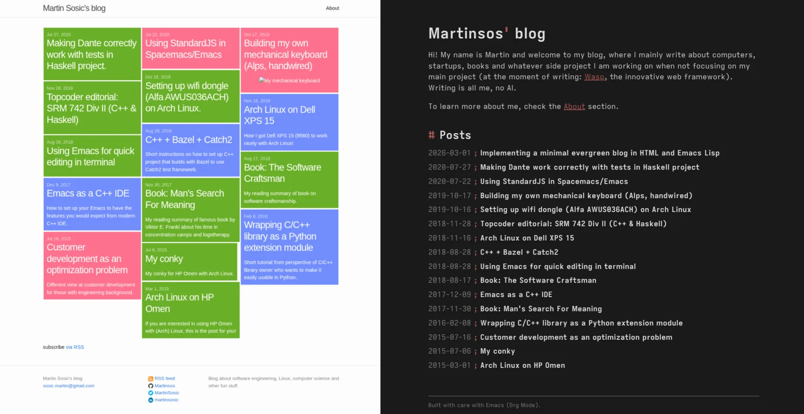

#+TITLE:Implementing a minimal evergreen blog in HTML and Emacs Lisp
#+DATE: 2026-05-01
#+DESCRIPTION: How I used Emacs' standalone scripting and Org mode's HTML export to implement an elegant build pipeline in Emacs Lisp for an Org mode driven static blog.
#+FILETAGS: :emacs:

#+TOC: headlines 1

* TL;DR:
I wanted to rewrite my blog from Jekyll to a minimal set of evergreen tech that won't get outdated in 10 years, while also being able to write posts in Emacs' Org mode instead of Markdown.

I ended up with an elegant solution based on basic html/css/js and Emacs (Lisp) as a build pipeline!

Here I describe how I did it and also share a repo[fn:1] with full working code.

* Time for a new blog +post+

Couple of weeks ago, inspiration for writing a blog post hit me. As it does every so.
But this time it was different, I was committed: I am writing this one, it has been too long.

How long that long has really been though, I realized only once I went to make a file copy of my last post: six years! I thought it was no more than a year, max two. While at it, I also remembered that my blog is implemented in Jekyll and that it has a Windows 8 inspired design, both of which I lost the excitement for in the meantime.

Am I to write this new post, special in a way, the first one after a long time, in such a non-exciting environment? Of course not!
So instead of finally writing a blog post, I decided I should rather re-do my blog first.

#+ATTR_ORG: :width 70%
#+CAPTION: Before and after

* The vision

This is what I came up with for the new version of my blog:
- *Minimal*: I want it to be minimal, so when I come back to it after again forgetting to write anything for six years, it doesn't feel outdated. Instead, it should be "evergreen". Stable, evergreen tech. Minimal, evergreen design. Hackerish.
- *Org mode*: I want to be able to write my blog posts in Emacs' Org mode[fn:2], which I got to love in the last year or so. Will it be much different from using Markdown, in practice? Probably not. Will I be enjoying typing every single blog post in it though? Absolutely!

I knew getting the second requirement (Org mode) sorted out was going to be harder, so I went after that first.
Thankfully, I found a perfect blog post/video[fn:3] from System Crafters that explained how to create a simple Org mode driven blog.
I expanded further on that and ended up with an implementation of my blog that is a lovely combo of basic web tech (html, css, js) and Emacs (Elisp and Org mode): minimal, simple, using evergreen tech, and hackerish/fun. In the rest of this blog post I will explain how this works.

At the end, I did end up writing that first blog post after 6 years, just that it wasn't the one I imagined at first -> instead, it is the one you are reading right now!

* Basic implementation

At the core of it are two things:
1. The capability of Emacs to execute a standalone Elisp script, in isolation: ~emacs -Q --script myscript.el~. Analogous to doing ~bash myscript.sh~.
   This is what Emacs people mean when they say Emacs is not a text editor, but an (e)lisp runtime with a built-in text editing library.
2. =ox-publish=, a built-in Emacs package that brings capabilities for exporting org files to various formats, including HTML.

This means that my blog is really just:
- a bunch of =.org= files for posts
- an Elisp script (=build.el=) to convert those org files into html
- some static =html/css/js= files (and other assets) for the rest of the blog
- a =Makefile= that orchestrates it all (development and building)

Here is what that roughly looks like, at its essence:
#+begin_src dirtree
  Makefile
  build.el
  src/
    index.html
    about.html
    main.css
    posts/
      my-post-1.org
      my-post-2.org
      my-post-2/some-image.png
  dist/  # gitignored, this is where the blog is generated.
#+end_src

#+begin_src ascii-diagram
                              make build
                                  |
                                  V
                          +--- build.el ---+
  src/                    |                |       dist/
    posts/*.org       ----+-- org to html -+---->    posts/*.html
    *.{html|css|...}  ----+----- copy -----+---->    *.{html|css|...}
                          |                |
                          +----------------+
#+end_src

In the =build.el= file, we have something like this:
#+begin_src emacs-lisp :filename build.el
  ;; Built-in package for exporting/publishing of org to html/latex/... .
  (require 'ox-publish)

  ;; Tweaking org-export and org-html options so that produced html fits our needs.
  (setq org-html-htmlize-output-type nil ; Don't style the code snippets.
        org-export-with-sub-superscripts '{} ; Require {} around sub/superscripts.
        ;;
        ;; ... likely quite a few more of these ...
        ;;
  )

  ;; Instructions on how to build the blog, i.e. how to export org files in posts/
  ;; dir to html and how to copy the rest of the files.
  (setq org-publish-project-alist
        '(("org-posts"
           :base-directory "./src/posts"
           :base-extension "org"
           :recursive t
           :publishing-directory "./dist/posts"
           ;; org-publish-to-html is a built-in function that converts org to html.
           :publishing-function org-publish-to-html
           :with-title nil
           ;; ... more options tweaking the output usually go here.
          )
          ("static-files"
           :base-directory "./src"
           :base-extension "html\\|css\\|js\\|png\\|jpg\\|gif\\|woff2"
           :recursive t
           :publishing-directory "./dist"
           ;; org-publish-attachment is a built-in function that just copies files.
           :publishing-function org-publish-attachment
          )
         )
  )

  (org-publish-all)
#+end_src

What I found great here is that =ox-publish= also comes with the =org-publish-attachment= function for just copying the static files, so I didn't have to write an additional shell script for doing that, but I can instead do building of the whole blog from one unified Elisp code.

The main thing I didn't find ideal was how much tweaking of default =org-export= and =org-html= options I had to do in order to get the exported html (from org) to fit my needs. By default, it produces a quite heavily opinionated and rich html, including default JS and CSS, that were obviously not made with the blog use case in mind. Luckily, with enough tweaking, one can get it into a usable shape reasonably easily, and as is always the case in Emacs, there are also multiple ways to go beyond that if you want to put more effort.

And the =Makefile= looks something like:
#+begin_src makefile :filename Makefile
  .PHONY build serve publish

  build:
          emacs -Q --script build.el

  serve:
          # ... something to serve contents of dist locally, for
          #     development, e.g. python-server or browser-sync.

  publish:
          # ... something to publish the contents of dist/ to
          #     your server / static hosting provider.
#+end_src

Note that this setup (due to ~-Q~ flag) is in no way dependant on or uses my normal Emacs configuration, that I use for editing. It uses Emacs only as an Elisp interpreter for executing ~build.el~, and it doesn't matter what I write the actual blog (posts) with.

This is it at its essence! As mentioned above, this is very similar to the approach described in the System Crafters' blog post[fn:3], so check there for more details.

* Advanced

In practice, I went further and added quite a few upgrades on top of the essential setup described above, and I will explain these upgrades at the high level below.

For full working code, check out my *github repo*[fn:1] that reflects the implementation of my blog at the moment of publishing this blog post.
You can try it out easily by checking it out and running ~make~, and if you want to create your own blog in Emacs Lisp, you can use it as a working starting point. Maybe change the design a bit ;).

** Syntax highlighting
Org's publishing logic by default highlights the exported code in the html, but that highlighting is quite rudimentary, so I turned it off.

While it could be enriched by configuring Emacs to use more complex highlighting, e.g. via tree-sitter, and then making sure that is exported correctly, I decided it would be much simpler to just do highlighting directly in the browser via JavaScript, independent of Emacs.

For that I ended up using [[https://highlightjs.org/][highlight.js]], which I downloaded and added to the assets, while making sure it also contains rules for Lisp.

I ended up quite liking how easy highlight.js is to extend. For example I had slight issues with how their =lisp= language highlighting works, as it wasn't highlighting comments inside quoted lists and some other small things, but it wasn't hard to copy their =lisp= language definition, rename it to =elisp=, and add the missing functionality.
I even ended up creating a couple of simple custom languages like =dirtree= and =ascii-diagram=.

** Fonts
I wanted custom fonts, but in line with my vision of the evergreen blog, I didn't want to link to the external ones, so I added the font ([[https://typeof.net/Iosevka/][Iosevka]]) files as assets and made sure they are linked to from the html head.

One thing with Iosevka though is that font files are big, ~1MB each file, to support all the fancy font features. This makes them tricky to use on the web. I wanted 4 styles, Regular, Italic, Bold, BoldItalic, for both propo and mono font, which totals up close to 10MB!

Solution was to "subset" the fonts -> there are tools that can modify the font files to contain only certain subsets of characters (I used [[https://github.com/fonttools/fonttools][fonttools]]), and merely by picking some reasonable subset that makes sense for web, I achieved 10x reduction in size, which is good enough.

** List of posts in Emacs Lisp
Be it generating a list of all the posts on the homepage, generating a sitemap, or generating an RSS feed XML, what you need is a list of posts (their metadata) at the blog build time, in our case in Emacs Lisp, so we can use it in other parts of our build pipeline.

This was as easy as reading all the .org files in =src/posts= dir, using Org mode to extract the keywords, and then organizing those into a list:
#+begin_src emacs-lisp :filename build.el
  ;; ...

  (defconst
    blog/all-posts
    (let ((org-files (directory-files (expand-file-name "./src/posts") t "\\.org$")))
      (sort
       (mapcar
        (lambda (f)
          (with-temp-buffer
            (insert-file-contents f)
            (org-mode)
            (let* ((keywords (org-collect-keywords '("TITLE" "DATE")))
                   (title (car (alist-get "TITLE" keywords nil nil #'string=)))
                   (date-str (car (alist-get "DATE" keywords nil nil #'string=)))
                  )
              (unless title
                (error "Post %s is missing #+TITLE" f))
              (unless (and date-str (not (string-blank-p date-str)))
                (error "Post %s is missing #+DATE" f))
              (list
               :date (blog/--parse-post-date date-str)
               :title title
               :filename (file-name-nondirectory f)
              )
            )
          )
        )
        org-files
       )
       (lambda (a b) (time-less-p (plist-get b :date) (plist-get a :date)))
      )
    )
  )

  ;; ...
#+end_src

I will show later how I use this data.

** index.org
I started with =index.html= and =about.html=, but soon I wanted to also write those in =.org=, so I turned them into =index.org= and =about.org=.

I quite liked that because I could now focus on content instead of the looks, and I anyway prefer them looking same/similar to posts, due to the minimal style of the blog.

And if I need custom html in those files, I can still easily insert it with ~export html~ org blocks, or generate it with Elisp org src blocks.

For instance, this enabled me to very elegantly insert html of an automatically generated list of all the posts in the =index.org=, from the posts metadata list I described in [[*List of posts in Emacs Lisp]], via a single ~elisp~ code block in =index.org=:

And then inside an emacs-lisp src block in the =index.org= file, with ~:exports results :results html~:
#+begin_src emacs-lisp
  (mapconcat
   (lambda (p)
     (let ((date-str (format-time-string "%Y-%m-%d" (plist-get p :date)))
           (title (plist-get p :title))
           (filename (plist-get p :filename)))
       (format (concat "<a class=\"post-entry\" href=\"./posts/%s\">"
                       "  <time datetime=\"%s\">%s</time>"
                       "  <b class=\"post-entry-title\">%s</b>"
                       "</a>")
               (string-replace ".org" ".html" filename)
               date-str
               date-str
               title)))
   blog/all-posts ; Global variable with metadata of all the posts.
   "\n")
#+end_src

** Building during development vs for publishing
I wanted to have incremental rebuild of my blog during development (e.g. to avoid copying images each time), which is already out of the box supported by =org-publish= and its file timestamp cache, so not much to do there.

On the other hand, I wanted to be sure that when publishing, I am publishing exactly what I want, no extra files from before and similar, which can easily happen when using incremental rebuild.

For that purpose, I added an additional ~make build-clean~ command that really does the same thing as my usual incremental rebuild but first deletes the whole =dist/= dir and also passes a flag to =org-publish= that deletes its file timestamp cache.

This way I both got a robust way to make sure I am publishing no less or more than what I wanted + an easy way to "reset" the build during development if things get messed up during incremental rebuilds.

#+begin_src emacs-lisp :filename build.el
  ;; ...

  (org-publish-all (getenv "ORG_PUBLISH_FORCE"))
#+end_src

#+begin_src makefile :filename Makefile
  build-inc:
  	emacs -Q --script build.el

  build-clean:
  	rm -rf dist/
  	ORG_PUBLISH_FORCE=1 $(MAKE) build-inc
#+end_src

** Serving locally during development
I hoped I could find a solution for running a local web server, with live reload, that is "evergreen" and requires no additional dependencies, but couldn't find anything that matches those criteria.

Best I found at the end is =browser-sync=, which I run via ~make serve~ like this:

#+begin_src makefile :filename Makefile
  build-inc:
  	emacs -Q --script build.el
  	date +"%Y-%m-%d %H:%M:%S.%3N" > .last_build_info

  # ...

  serve:
  	npx browser-sync start --server dist --files ".last_build_info" --port 8080
#+end_src

What is that =.last_build_info= file though, you might be wondering? I just couldn't get =browser-sync= to properly detect the changes to the source files of my blog, for the purpose of live reload, so I ended up producing this additional "build info" file on every rebuild, which then I have =browser-sync= watch and react to. A bit of a workaround, but it is robust and is efficient regarding files watched.

** Compiling from Emacs during development
I love having a Makefile as a "project runner" because I know there is a single place with defined (and documented) typical commands that I need for my project. It even gets autocomplete in the shell! And it is both very minimal and "evergreen".

Nice thing is that it then also becomes very easy to compile/build your project from the editor/IDE of your choice, you just need to configure it to run specific ~make~ commands for that project.

In Emacs, I ended up using the built-in =compile= functionality, specifically =project-compile= (and =project-recompile=) command, which by default runs ~make -k~, meaning I actually had nothing to configure! In practice, that means that all I have to do to rebuild the blog while working on it is to hit a keybinding for =project-compile= (in my case =SPC x P=) and that is it.

** Org export backend
By default, =ox-publish= (=ox= stands for "org export") is highly opinionated on how it exports =org= into =html=, and you will want to turn off all these premade choices.

I started doing this by =setq=-ing all the individual global vars that tweak how exporting works (=org-export-*= and =org-html-*= vars), but then I learned that one can define their own "export backend", which dictates how exporting is performed, and while defining it, extend the existing one.

At the end, I ended up with almost all of the logic in my custom export backend =blog/html= that derives =html= backend. This is a more elegant solution as you are not tweaking global vars but can invoke your own backend when you want, and the whole experience of defining it is nicer.
I did still end up with a couple of global vars I had to tweak because they were not tweakable via backend, but that number was now much smaller.

#+begin_src emacs-lisp :filename build.el
  ;;; ...
  (org-export-define-derived-backend 'blog/html 'html
    :options-alist
    '((:html-doctype nil nil "html5")
      (:html-html5-fancy nil nil t)
      (:html-validation-link nil nil nil)        ; Skip weird default html validation link.
      (:html-head-include-scripts nil nil nil)   ; Skip default JS.
      ;;; ...
     )
  )
  ;;; ...
#+end_src

** Making html ids that org-publish generates deterministic
By default, =ox-publish= assigns random =id= to generated html elements, which means that each time you build/publish your blog post, they all will have changed. This means nobody can make a stable reference to any of your html ids, also that each time you are republishing a lot of files even if you changed just one of them, ... .

Based on this [[https://github.com/alphapapa/unpackaged.el?tab=readme-ov-file#export-to-html-with-useful-anchors][solution by alphapapa]], I solved this problem by advising the =org-export-get-reference= and =org-publish-resolve-external-link= functions with my logic that slugifies titles (e.g. "Test title!" -> "test-title") when generating id for a heading and creates sequential counters ("el-0", "el-1", ...) for other elements.

This was quite involved regarding understanding Org mode internals, but with the existing starting point by alphapapa and LLM help I was able to get to a solution that seems satisfactory.

** Splitting build.el into multiple files
As it grew, I split =build.el= into multiple files that require each other, for two main reasons:
1. To move "layout" logic into =src/= dir together with the rest of the content, away from the build logic in the =build/= dir.
2. To keep the build logic maintainable and easier to work with (separation of concerns).

#+begin_src dirtree
  # ...
  build/
    blog-build.el # Main entrypoint for the build pipeline.
    blog-org-publish-html.el # How we export org to html.
    blog-paths.el # Common file paths.
    blog-data.el # Blog (meta)data available globally (e.g. metadata on all the posts).
    org-export-dtrm-refs.el # Deterministic ids in exported html.
  src/
    # ...
    layout.el # Common html head, postamble, reusable pieces of html, ... .
    posts/
      # ...
      layout.el # Posts-specific html preamble, postamble, inner template,  ... .
#+end_src

*** Doing =require= correctly

Most challenging part here turned out to be figuring out how to have the scripts =require= each other while having it work in all three environments that I cared about:
1. ~emacs -Q --script~ -> the most important since this is what builds the blog.
2. In-buffer eval -> useful during development.
3. Flycheck -> we don't want false errors while editing the buffer.

What made this hard was the mix of these three, especially (1) and (3), since ~emacs -Q --script~ is not a common use case, while on the other hand Flycheck performs its analysis in its own environment. If you use usual methods of requiring other files, one of these won't work correctly (e.g. Flycheck).

I ended up going with file-explicit =require= forms that ~or~ over three different ways to get a parent directory, covering all the three environments and satisfying Flycheck during its compile time analysis:

#+begin_src emacs-lisp
  (require
   'other-script
   (expand-file-name "./other-script.el"
                     (file-name-directory (or load-file-name
                                              buffer-file-name
                                              default-directory))))
#+end_src

Verbose, but it was the only solution I found to work, I don't actually use it in so many places so it doesn't feel terrible, and I do like that it is explicit (vs e.g. some kind of separate machinery in =.dir-locals.el= to trick Flycheck).

I created a small [[https://github.com/Martinsos/emacs-script-load-path-repro][GitHub repo]] to showcase both the issue and the solution I found.

** Generating RSS feed
Probably the easiest way to enable external parties to subscribe to new posts on your blog is to have an RSS feed (e.g. =https://myblog.com/rss.xml=).
And ideally that feed would be automatically updated when you add a new post.

We will go one by one through crucial components needed to set up and automatically generate an RSS feed in our blog.

*** A list of posts metadata in Emacs Lisp
This is the core data we need to generate our RSS feed, and we already set it up in [[*List of posts in Emacs Lisp]].

*** RSS XML generation logic
Assuming we have a list of posts metadata, we now need to know how to shape it up into RSS XML and write it to =rss.xml= file.

I won't be posting the whole code here, you can check the full blog code[fn:1] if you wish to see it, but it came down to creating a =build/blog-rss.el= with =(defun blog/rss-generate= that uses a list of posts metadata we prepared before to generate the RSS XML and write it to =dist/rss.xml=.

Some interesting parts to mention is not to forget to use =xml-escape-string= for stuff like post title and description, and then also to make sure to format the dates with RFC-822 format.

*** Triggering our RSS XML generation logic on each blog (re)build
Turns out that =org-publish='s =org-publish-project-alist= has =:completion-function= property for triggering custom logic right after building/publishing is done, which is perfect place to run our RSS generation logic!

#+begin_src emacs-lisp :filename build.el
  ;;; ...
  (setq org-publish-project-alist
        `(("org-posts"                                 ; <- Notice I turned ' into ` here.
           :base-directory "./src/posts"
           :base-extension "org"
           :recursive t
           :publishing-directory "./dist/posts"
           :publishing-function org-publish-to-html
           :completion-function (,#'blog/rss-generate) ; <- We added this.
           :with-title nil
          )
          ;;; ...
         )
  )
  ;;; ...
#+end_src

*** <link> in <head> to announce the RSS feed
To make our RSS feed easily discoverable to external tools, we need to put a special link in the head:

#+begin_src html
  <link rel="alternate" type="application/rss+xml"
        title="My blog" href="https://myblog.com/rss.xml" />
#+end_src

** Performance and SEO optimizations
Finally I did some basic perf/SEO optimizations to achieve a decent Lighthouse score:
- Reduced size of font files by subsetting.
- Added helper tool to optimize images for size and format (webp).

  I didn't want to complicate build pipeline further with automatic step for image optimization, so I kept it manual.
- Added robots.txt.
- Made highlight.js JS and CSS loading deferred.
- Fixed the semantics of main page elements:
  #+begin_src emacs-lisp
    (org-export-define-derived-backend 'blog/html 'html
      ;; ...
      (:html-divs nil nil '((preamble "header" "preamble")
                            (content "main" "content")
                            (postamble "footer" "postamble")))
    )
  #+end_src

* Conclusion
At the end, I am really happy how the new version of my blog turned out: I feel like I succeeded in my goal to have something very solid and evergreen while also minimalist.
I also had great fun while setting this all up, using Emacs (Lisp) in ways I never had before (standalone scripting), and I love it that I can write posts in Org mode.

The most annoying part was stamping out all the defaults of org-publish exporting to html, while probably the coolest part is that I can inject Elisp code blocks into any page (since they are all =*.org=) to generate custom html in-place.

This blog is my own personal part of the internet, my act of expression, and it feels like I made it truly my own.

* Related work
- System Crafters' "Build Your Website with Org Mode"[fn:3]: what I based my implementation on.
- [[https://weblog.masukomi.org/2024/07/19/using-org-mode-with-hugo/][Hugo with Emacs' Org mode export]] via [[https://ox-hugo.scripter.co/][ox-hugo]]: probably the most popular approach out there.
- [[https://lucidmanager.org/productivity/create-websites-with-org-mode-and-hugo/][Hugo with its built-in Org mode support]]: simpler than using ox-hugo but also somewhat less flexible.
- [[https://labs.phundrak.com/phundrak/config.phundrak.com][Vuepress + Org mode]]
- [[https://drollery.org/blog/astrojs-and-orgmode/][Astrojs & Org mode]]
- [[https://github.com/bastibe/org-static-blog/][org-static-blog]]: I actually haven't checked out this one properly yet, but has quite some GitHub stars and seems active.

* Footnotes
[fn:1] https://github.com/Martinsos/blog-in-emacs-lisp
[fn:3] https://systemcrafters.net/publishing-websites-with-org-mode/building-the-site/
[fn:2] [[https://orgmode.org/][Org mode]] is, to oversimplify it, kind of like Markdown on steroids. It is not so easy to shortly explain the extent to which Org mode can go, but it has such a rich and powerful ecosystem built around it that many people use Emacs just for it. You can use it for writing, literate programming, productivity (e.g GTD), note taking, calculations, ... .
